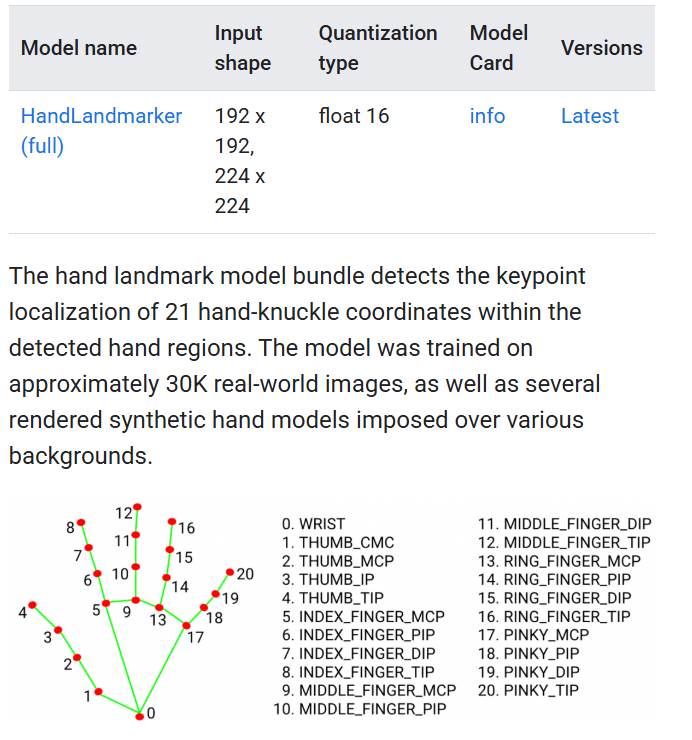

# Process Result Data Format
- valid | int
    - 0 for valid packet 1 for not valid
- gesture | GESTURE_ENUM
    - PINCH: 0
    - FIST: 1
    - OPEN: 2
    - NONE: 3
- hand_type | HAND_TYPE_ENUM
    - LEFT_HAND | 0
    - RIGHT_HAND | 1
- hand_position
    - Vector2(float, float)
        - x, y coordinates


# Notes on Params
```py
    # Minimum confidence for hand detection
    min_hand_detection_confidence=0.5,

    # Minimum confidence for tracking
    min_hand_presence_confidence=0.5,

    # Minimum confidence for gesture classification
    min_tracking_confidence=0.5,

    # Use video mode for webcam streams
    # IMAGE = single image
    # VIDEO = sequential frames
    # LIVE_STREAM = async webcam
    running_mode=VisionRunningMode.VIDEO
```

# Hand Landmarks



# Used sources
- ChatGPT
- https://ai.google.dev/edge/mediapipe/solutions/vision/hand_landmarker/index#models
- https://medium.com/@florian-trautweiler/real-time-hand-tracking-in-python-e2bcdd0feace
    - Not using this, we are using gesture since this alr bundled

Gesture:
- https://medium.com/@odil.tokhirov/how-i-built-a-hand-gesture-recognition-model-in-python-part-1-db378cf196e6

